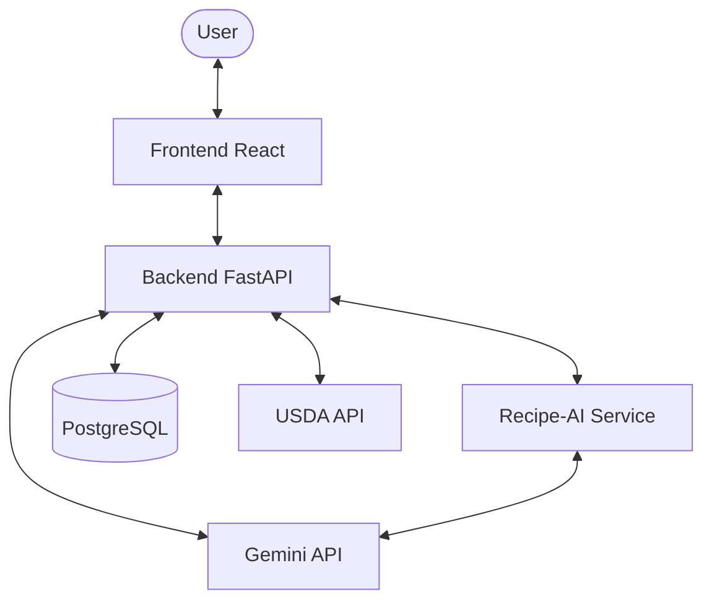

# Food Nutrition App

According to multiple research papers, international students worldwide face **food malnourishment**. This application aims to solve this by helping users manage their pantry, track nutritional value, and generate healthy, diabetic-friendly recipes using AI.

## Core Features

1.  **Receipt Scanning (OCR)**: Extract food items from grocery lists/receipts using Gemini's vision capabilities.
2.  **Pantry Management**: Store food items in a database with optional expiry dates.
3.  **AI-Generated Recipes**: Create healthy, diabetic-friendly recipes prioritizing items that will expire soon.
4.  **Nutritional Tracking**: Return nutritional values (per 100g) for calories, protein, fiber, etc., including health summaries.

## Technical Stack

- **Frontend**: React (React Router 7), TypeScript, Tailwind CSS, TanStack Query, FontAwesome, Nivo Charts.
- **Backend**: Python, FastAPI, SQLAlchemy (PostgreSQL).
- **Recipe-AI Microservice**: Python, FastAPI, HuggingFace Transformers (Local AI).
- **External APIs**: 
    - **USDA FoodData Central**: For nutritional lookups.
    - **Google Gemini**: For OCR, recipe summarization, and health insights.

## Project Architecture



## Setup Instructions

### Prerequisites
- [Docker](https://docs.docker.com/engine/install/) and [Docker Compose](https://docs.docker.com/compose/install/)
- [Node.js](https://nodejs.org/) (v18+)
- [Python](https://www.python.org/) (3.12+)

### 1. Database & Infrastructure
Start the database and management tools:
```sh
docker compose up -d
```
- **PostgreSQL**: Port `5432`
- **Adminer**: Port `8080` (Manage DB at [http://localhost:8080](http://localhost:8080))

### 2. Environment Configuration
Copy the template and fill in your API keys:
```sh
cp .env.dev .env
```
- Obtain a **USDA API Key** at [fdc.nal.usda.gov](https://fdc.nal.usda.gov/api-key-signup.html).
- Obtain a **Gemini API Key** at [aistudio.google.com](https://aistudio.google.com/).

### 3. Backend Setup
```sh
cd backend
python -m venv .venv
source .venv/bin/activate  # Or .venv\Scripts\activate on Windows
pip install -r requirements.txt
python seed.py             # Seed initial data
uvicorn main:app --reload
```
Runs at [http://localhost:8000](http://localhost:8000).

### 4. Recipe-AI Service Setup
```sh
cd recipe-ai
python -m venv .venv
source .venv/bin/activate
pip install -r requirements.txt
uvicorn main:app --port 8001
```

### 5. Frontend Setup
```sh
cd frontend
npm install
npm run dev
```
Runs at [http://localhost:5173](http://localhost:5173).

## Development
- **Database Migrations**: Managed via SQLAlchemy models.
- **Testing**: Follow existing patterns in each directory.
